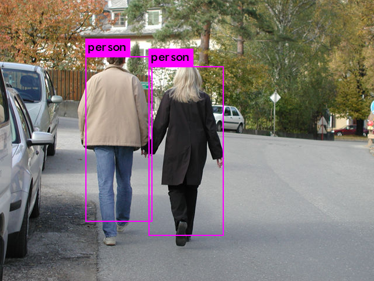
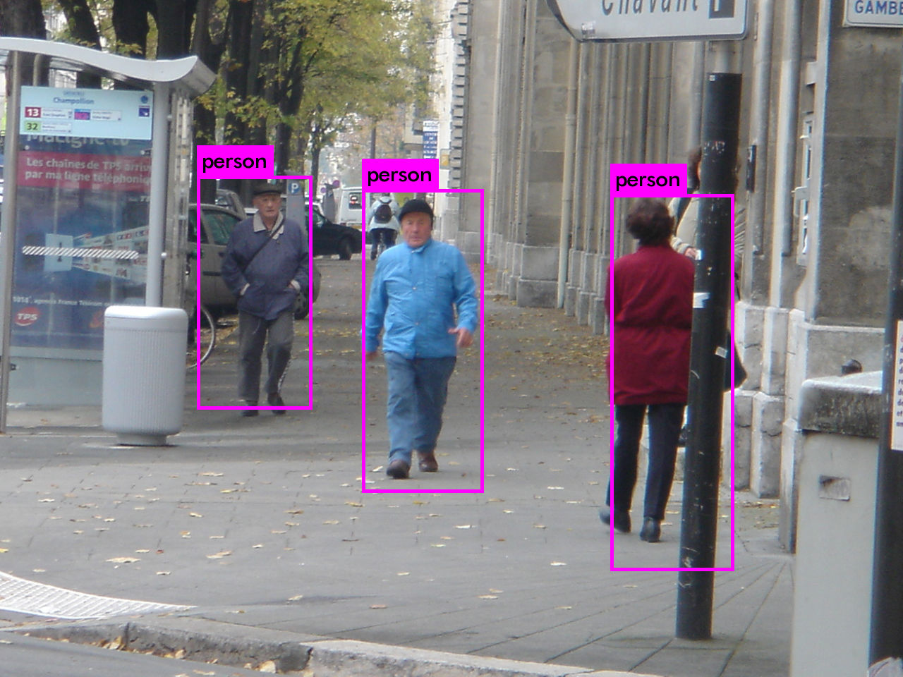

# Yolov2
Train custom yolo algorithm - person detection
<p>
    Yolo algorithm needs to be trained on GPU, if you don't have one you can use
    <a href = "https://colab.research.google.com/">Google Colaboratory</a>.
    It's a cloud service which provides free GPU.
    We'll use the darknet implementation of yolo from
    <a href ="https://github.com/pjreddie/darknet">Pjreddie</a>.
    You can also use the one of <a href ="https://github.com/AlexeyAB/darknet">AlexeyAB</a>.
    I advise you to read the section about yolo from 
    <a href="https://stanford.edu/~shervine/teaching/cs-230/cheatsheet-convolutional-neural-networks#object-detection">Stanford.edu</a>
    to know how it works.
</p>
<p>
    <h3>Example</h3>
     <p float="left">
        
        
    </p>
</p>
<p>
    <h2>Download and install Darknet</h2>
    Clone Darknet repository 

  ```
  git clone https://github.com/pjreddie/darknet.git
  cd darknet
  make
  ```
  Before make, you can set many options in Makefile, i've used the following :
  <ul>
      <li>GPU=1, build with CUDA to accelerate by using GPU</li>
      <li>OPENCV=1, build with OpenCV 3.x/2.4.x - allows detection on video</li>
  </ul>
  See <a href ="https://github.com/AlexeyAB/darknet">AlexeyAB repository</a> for
  complete list.
</p> 
<p>
    <h2>Data preparation</h2>
    <p>
        You have two possibilities:
        <ul>
            <li>Use an annotated dataset</li>
            <li>Compose your own training set with annotation</li>
        </ul>
        <h3>Annotated dataset</h3>
        You can choose to use an already annotated dataset to save few hours,
        for example i've used the 
        <a href ="http://pascal.inrialpes.fr/data/human/">
        INRIA Person dataset</a>. If you use an already annotated dataset, be
        sure that the annotations respect the yolo format, if not, you'll have 
        to convert the annotations to the expected format.
        <h3>Compose your own training set</h3>
        If you choose to create your own dataset, you'll need to annotate your
        data, many tools are available :
        <ul>
            <li><a href ="https://github.com/tzutalin/labelImg">LabelImg</a></li>
            <li><a href ="https://github.com/puzzledqs/BBox-Label-Tool"> BBox Label Tool </a></li>
        </ul>
    </p>
</p>
<h3>In both cases</h3>
Each image of the dataset must be in the directory <b>darknet/data/obj</b>
and have its corresponding .txt annotation file in yolo annotation format.
<h5>Directory structure :</h5>

```
+-- _darknet
|   +--- darknet19_448.conv.23
|   +--- _data
|   |    +--- _obj
|   |         +--- images1.jpg image1.txt image2.jpg image2.txt ...
|   +--- _cfg
|        +--- yolov2_tiny_voc.cfg obj.names obj.data
```
<h5>Yolo annotation format :</h5>

```
<object-class> <x> <y> <width> <height>

```

<p>
    <ul>
        <li><b>object-class</b> Integer corresponding to the class index</li>
        <li><b>(x,y)</b> are coordinates of the bounding-box's center</li>
        <li><b>x y width height</b> - float between 0.0 and 1.0</li>
        <li><b>x</b> = absolute_x / image_width and <b>y</b> = absolute_y / image_height</li>
        <li><b>height</b> = absolute_height / image_height and <b>width</b> = absolute_width / image_width</li>
    </ul>
</p>

Example image.txt annotation for an image with two bounding box:

```
0 0.5103092783505154 0.4175204918032787 0.24948453608247423 0.6014344262295082
0 0.6639175257731958 0.3975409836065574 0.18969072164948453 0.6147540983606558
```

Create obj.names in the directory /darknet/cfg/ with classes names
    
```
classe1
...
    
``` 

Create obj.data in the directory /darknet/cfg/ 
    
```
classes = 1
train  = train.txt
valid  = test.txt
names = cfg/obj.names
backup = backup/
...
    
``` 

<p>
    <h3>Train Darknet</h3>
Train the model with the following command : 
    
```
./darknet detector train cfg/obj.data cfg/yolov2-tiny-voc.cfg darknet19_448.conv.23
```
You can stop and restart training from last checkpoint using the following 
command :

```
./darknet detector train cfg/obj.data cfg/yolov2-tiny-voc.cfg backup/yolov2-tiny-voc.backup
```
</p>

<p>
    <h3>Run detector</h3>
    
```
./darknet detect cfg/yolov2-tiny-voc.cfg yolov2-tiny-voc.weights image.jpg
```

</p>